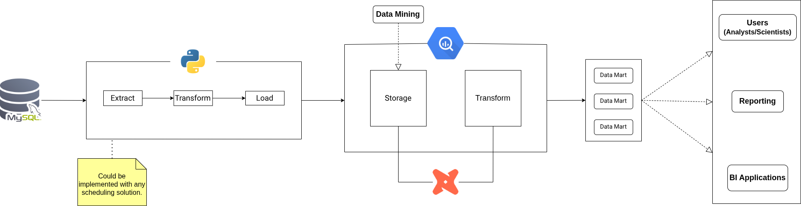
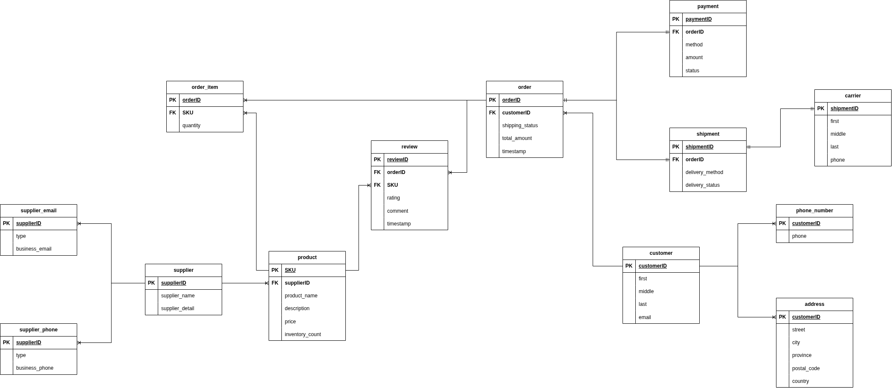
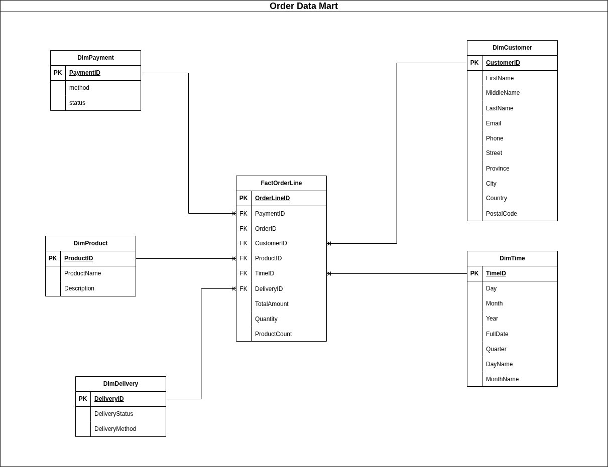
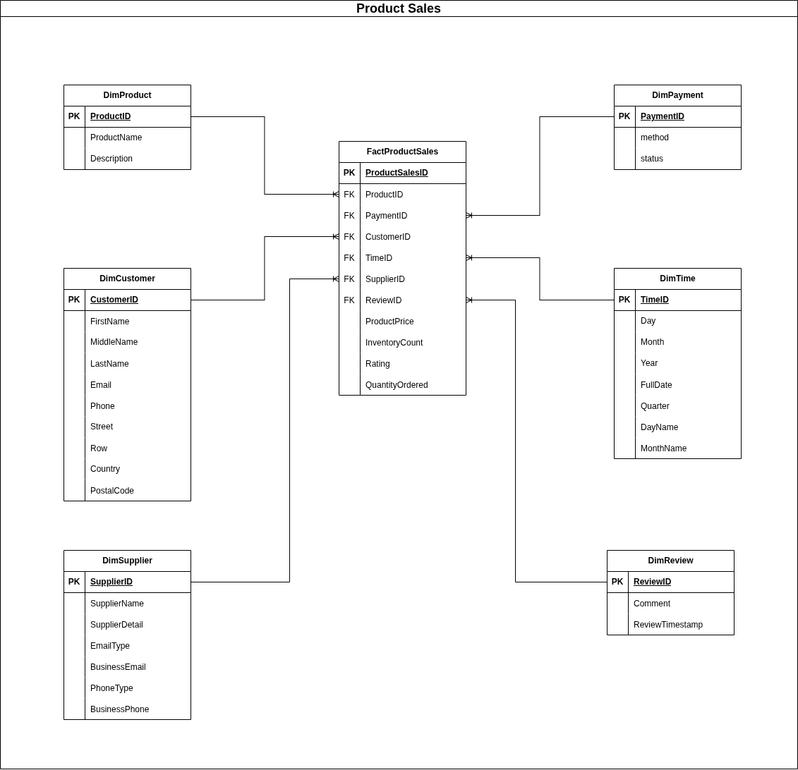

# Shopsphere Data Warehousing
This is the code repository that hold source code folders for the case study of Shopsphere, an (artificial) multi-region e-commerce organization. It offers products across multiple fields like Electronics, Fashion, Home & Kitchen, and Health & Beauty. The pipeline extracts data from a pre-built data model hosted in MySQL, merges it into a unified table, and loads the result into BigQuery for further transformation and modeling using dbt Cloud.

## Project Architecture



Note: If the represented diagram is blurred, click/choose the image directly for full observation capability. 

## Features

### Data source

Data that was used for the project is generated through the use of [Faker package](https://faker.readthedocs.io/en/master/). The nature of the datasets are mostly random, but the relational and referential integrity between each dataset is align with the developed schema that was physically modeled and hosted inside MySQL, which had been tested and generally optimized.



### Data extraction

- Connects to target database and perform `SELECT *` on each table.
- Data is extracted sequentially through using looping technique.
- Using pandas methods combined with parameters to customize the result.
- Support chunk size extraction when `chunk_size` is set
- Exception handling and logging are implemented to capture errors.
- The function returns extracted tables stored in key-value format (dict).

### Data transformation

- Receives a dictionary that stores table names and attributes in key-value format.
- Parameter merge_order is an optional parameter that can be configured to specify the merging method.
- Utilizes helper function stored in `./utils` module to reduce complexity.
- After merging successfully, memory will be cleaned up through using `gc.collect()`
- Exception handling and logging are implemented to capture errors.

### Data loading

- Establishes a connection to BigQuery using a helper function from the `./utils` module.
- Accepts a DataFrame and configuration parameters for project, dataset, and table.
- Loads data in configurable chunk sizes to optimize performance.
- Exception handling and logging are implemented to capture errors.
- Cleans up memory after each batch using `gc.collect()` to manage resources efficiently.

### Serving layer

Data is transformed right inside the warehouse and modeled into data marts that align with dimensional modeling principles:






## Usage

### Prerequisites

For Python, you would need to have these external libraries installed:    

- pandas 
- SQLAlchemy
- google-cloud-bigquery

Users can install any version of the packages as they see fit, but the project would benefit more from newer versions.

Users would also need active accounts for Google Cloud Services and dbt Cloud. dbt Cloud would also need to be configure, which users could find out more via [this link](https://docs.getdbt.com/docs/cloud/about-cloud-setup).

### Database setup

Users can use any relational database to hold the schema and apply any modification/optimization strategies as they see fit. All CREATE commands are provided in `./Database`. 

### Package installation

Supposed that you have already had an active virtual environment, run:
```
pip install pandas SQLAlchemy google-cloud-bigquery
```
### dbt Cloud

Supposed that you have already created acounts for both BigQuery and dbt Cloud, along with an established configuration connecting both platforms: 

- Create a folder structure (you can also mimics the structure of `./Transformation` folder of this project) inside your dbt Cloud development environment.
- Paste the scripts in your workplace sequentially (modifications can be safely done to suit your needs).
- Configure your dbt Cloud's paths in `dbt_project.yml` to match your folder structure (for more information, please refer to [this link](https://docs.getdbt.com/reference/dbt_project.yml))
- Paste or build your own test models and store them in `./tests`.
- Add documentations to models (for more information, refer to [this link](https://docs.getdbt.com/docs/build/documentation))
- Create a deployment environment ([this link](https://docs.getdbt.com/docs/deploy/deploy-environments) can help)
- Scheduling dbt Cloud job (refer to [this](https://docs.getdbt.com/docs/deploy/job-scheduler) for more information)

### Running the project

For the Python ETL layer, the whole pipeline can be invoked manually through executing the `execute.py` script that orchestrates the extraction, transformation, and loading processes.
```

python Processing/execute.py
```
Data is then loaded into BigQuery and uses the cloud vendor as a staging layer for further processing. Scheduled models inside dbt Cloud will run automatically based on job schedule configurations to transform data efficiently.

## Orchestration options

While the current ETL pipeline operates effectively without orchestration, as the data environment scales, introducing a dedicated orchestration framework can improve dependency management, scheduling flexibility, error handling, and monitoring. This section outlines orchestration tools that could be integrated into the project.

### Cron jobs (Linux) or Windows Task Scheduler

- A simple OS-based scheduler can trigger the ETL script at predefined intervals.
- Low overhead and does not require additional framework installations.

However, this approach lacks dependency tracking, failure retries, and visibility into execution history.

### Apache Airflow

- Airflow DAGs (Directed Acyclic Graphs) can be used to orchestrate the ETL steps as distinct tasks with dependencies.
- Rich scheduling features, dependency tracking, retries, logs, and UI-based monitoring.

There are some major drawbacks, such as:

- Would require significant script restructuring to break down the ETL process into separate tasks.
- XCom limitation—passing large DataFrames through tasks is discouraged, requiring alternative solutions like writing to intermediate storage (e.g., cloud bucket).

### Hybrid approach: Scheduling with cloud storage intermediates

If restructuring for orchestration is too complex, a hybrid model can be adopted:

- Use a scheduler (e.g., cron) to trigger the ETL process.
- Store intermediate results in cloud storage or database for retry capability.
- Downstream tasks read from storage rather than relying on direct task passing.

This approach balances maintaining current code structure while allowing for future orchestration expansion without major refactoring.

